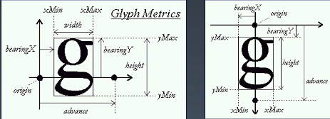
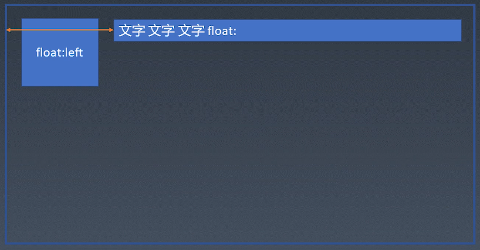
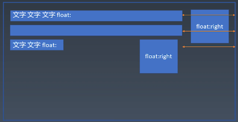
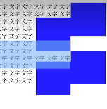
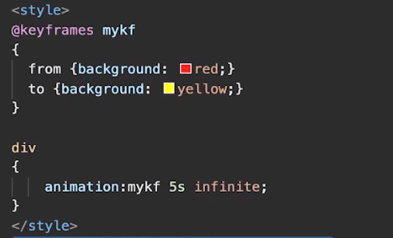
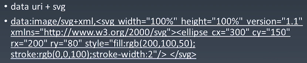

# CSS排版
## 盒
* HTML代码中可以书写开始标签，结束标签，和自封闭标签。
* 一对起止标签，表示一个元素。
* DOM树中存储的是元素和其它类型的节点（Node）。
* CSS选择器选中的是元素。
* CSS选择器选中的元素，在排版时可能产生多个盒。
* 排版和渲染的基本单位是盒。

### 盒模型
* 外边距（margin）
* 边框（border）
* 内边距（padding）
* 内容（content）具有宽（width）高（height）
  * box-sizing为content-box时，宽高为内容本身宽高
  * box-sizing为border-box时，宽高为内容+内边距的宽高

## 正常流
当下的排版方式有三代
1. 正常流
2. flex布局
3. grid布局

### 排版
* 手机盒进行
* 计算盒在行中的排布
* 计算行的排布

### 排布方式
* IFC：行级元素的排版方式
* BFC：块级元素的排版方式

## 正常流的行级排版
* BaseLine

  

* Text

  

* 行模型

  

## 正常流的块级排版
* 浮动（float）
  * 浮动会自动排挤出自己的空间
  
  * 浮动元素相靠时会产生堆叠现象
  
* 清除浮动（clear）
  * 清除浮动可以避免浮动元素堆叠

    

* 边距折叠
## BFC合并
* block box && overflow:visible
  * BFC合并与float
  * BFC合并与边距折叠
## Flex排版
* 收集盒进行
  * 根据主轴尺寸，把原始分进行
  * 若设置了no-wrap，则强行分配进第一行
* 计算盒在主轴方向的排布
  * 找出所有Flex元素
  * 把主轴方向的剩余尺寸按比例分配给这些元素
  * 若剩余空间为负数，所有flex元素为0，则等比压缩剩余元素
* 计算盒在交叉轴方向的排布
  * 根据每行中最大的元素的尺寸计算行高
  * 根据行高flex-align盒item-align，确定元素具体位置

# CSS动画与绘制
## 动画
* Animation
  * @keyframe定义
  * animation：使用

  
* transition
## 颜色
* CMYK与RGB
* HSL与HSV

## 绘制
* 几何图形
  * border
  * box-shadow
  * border-radius
* 文字
  * font
  * text-decoration
* 位图
  * background-image
  
