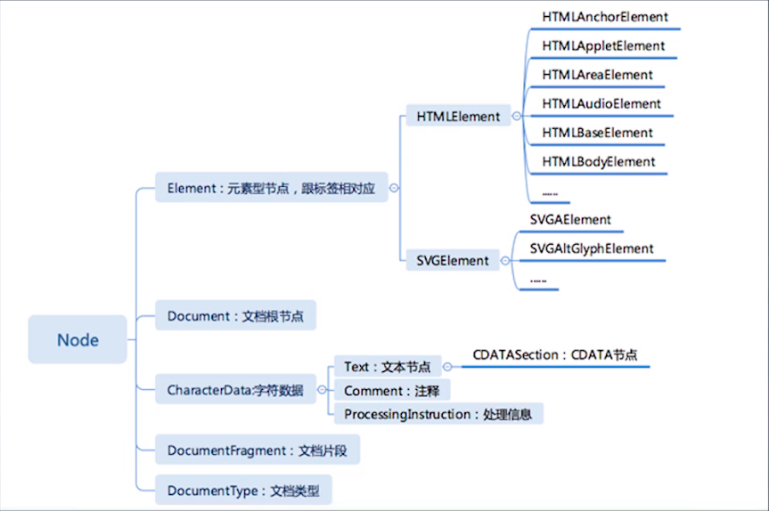

# 重学HTML
## HTML的定义
### DTD与XML namesapce
* [http://www.w3.org/TR/xhtml1/DTD/xhtml1-strict.dtd](http://www.w3.org/TR/xhtml1/DTD/xhtml1-strict.dtd)
* [http://www.w3.org/1999/xhtml](http://www.w3.org/1999/xhtml)

### 应该记住的一些转义符
* &quot 双引号 属性值一般由双引号包裹，里面的双引号得用转义符
* &amp &符 &会被当成转义符开头，不能直接用
* &lt 小于号 标签开头
* &gt 大于号 标签结束

## HTML语义化
* aside 非页面主体部分
* a 超链接
* main 页面主体部分，网页唯一
* article 文章主体内容
* h1~6... 页面标题
* hgroup 标题组
* hr 分段信号
* p 文章段落
* abbr 缩写
* em 强调重音
* strong 强调重要性
* figure 图片组
* img 图片
* figcaption 图片说明
* li 列表元素
* ul ol 有序和无序
* nav 页面导航
* dfn 词的定义
* samp 案列
* pre 已预处理文本
* code 代码文本
* footer 文档末尾

## HTML语法
### 合法元素
* Element：\<tagname>...\</tagname>
* Text：text
* Comment：\<!-- comments -->
* DocumentType：\<!Docment html>
* ProcessingInstruction：\<?a 1?>
* CDATA：\<![CDATA[]]>

### 字符引用
* \&#161;
* \&amp;
* \&lt;
* \&quot;

# 浏览器API
## DOM API


### 导航类操作
* Node
  * parentNode
  * childNodes
  * firstChild
  * lastChild
  * nextSibling
  * previousSibling
* Element
  * parentElement
  * children
  * firstElementChild
  * lastElementChild
  * nextElementSibling
  * previousElementSibling

### 修改操作
* appendChild
* insertBefore
* removeChild
* replaceChild

### 高级操作
* compareDocumentPosition - 比较两个节点中关系的函数
* contains - 检查一个节点是否包含另一个节点的函数
* isEqualNode - 检查两个节点是否完全相同
* isSameNode - 检查两个节点是否是同一节点，可用JavaScript===代替
* cloneNode - 复制一个节点，如果传入一个参数true，则会连同子元素做深拷贝

## 事件 API
### 注册事件
* target.addEventListener(type, listener, options);
  * type 事件类型
  * listener 触发事件执行的操作
  * options
    * capture: boolean 是否捕获事件 默认false为冒泡事件
    * once: boolean 只触发一次listener 默认false
    * passive: boolean 使阻止默认行为事件失效 默认false
### 事件的冒泡和捕获
* 冒泡 浏览器计算出触发事件的元素，然后层层向父级元素传递
* 捕获 浏览器计算出触发事件的元素

## Range API
### range
* setStart
* setEnd
* setStartBefore
* setEndBefore
* setStartAfter
* setEndAfter
* selectNode
* selectNodeContents
* extractContents
* insertNode

面试题：把一个元素所有的子元素逆序
```
1         5
2         4
3         3
4         2
5         1
```
range实例解答
```
let element = document.getElementById('a');

function reverseChildren(element) {
  let range = new Range();
  range.selectNodeContents(element);

  let fragment = range.extractContents();

  const l = fragment.childNodes.length;
  while (l-- > 0) {
    fragment.appendChild(fragment.childNodes[l]);
  }
  element.appendChild(fragment);
}

reverseChildren(element);
```

## CSSOM
* document.styleSheets
  * Rules
    * document.styleSheets[0].cssRules
    * document.styleSheets[0].insertRule("p { color: pink; }", 0)
    * document.styleSheets[0].removeRule(0)
  * Rule
    * CSSStyleRule
      * selectorText String
      * style K-V 结构
    * ......
* getComputedStyle(el, pseudoEl)
  * el 想要获取的元素
  * pseudoEl 可选，伪元素

## CSSOM View
* window
  * innerHeight, window.innerWidth
  * outerWidth, window.outerHeight
  * devicePixelRatio
  * screen
    * width
    * height
    * availWidth
    * availHeight
  * open("about:blank","_blank","width=100,height=100,left=100,right=100")
    * moveTo(x,y)
    * moveBy(x,y)
    * resizeTo(x,y)
    * resizeBy(x,y)
  * scrollX
  * scrollY
  * scroll(x,y)
  * scrollBy(x,y)
* scroll
  * scrollTop
  * scrollLeft
  * scrollWidth
  * scrollHeight
  * scroll(x,y)
  * scrollBy(x,y)
  * scrollIntoView()
* layout
  * getClientRects()
  * getBoundingClientRect()

## 其他API
我们的API来自这四个标准化组织
* knronos
  * WebGL
* ECMA
  * ECMAScript
* WHATWG
  * HTML
* W3C
  * webaudio
  * CG/WG