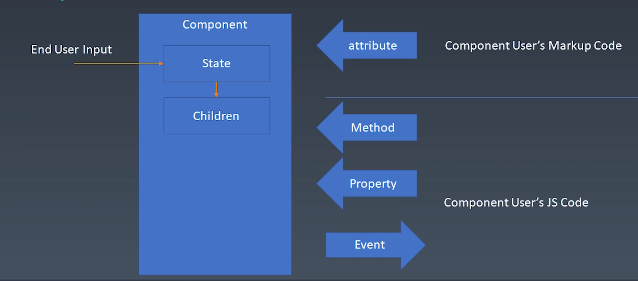
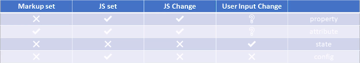
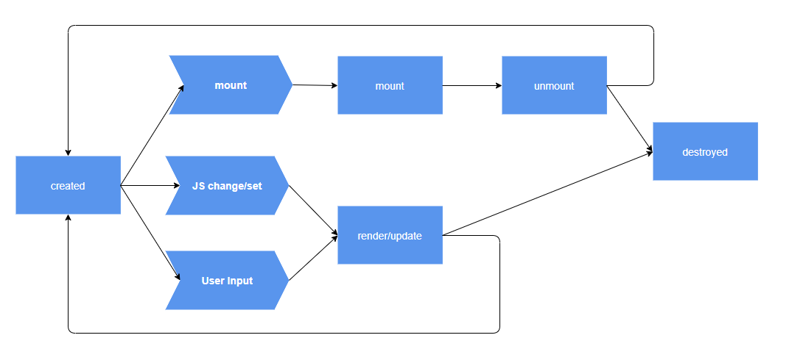

# 组件的基本知识
* 对象
  * Properties 属性
  * Methods 方法
  * Inherit 对象之间的继承关系
* 组件
  * Properties 属性
  * Methods 方法
  * Inherit 组件之间的从属关系
  * Attribute 属性(主要用于描述组件，一般用标记语言来实现)
  * Config & State 组件的状态
  * Event 组件往外传递的事件
  * Lifecycle 组件从创建到销毁之间经历的各个阶段构成组件的生命周期
  * Children 子组件

## Component

## Attribute VS Property
* Attribute 强调描述性
* Property 强调从属关系

## 如何设计组件状态

## Lifecycle

## Children
* Content型Children
* Template型Children